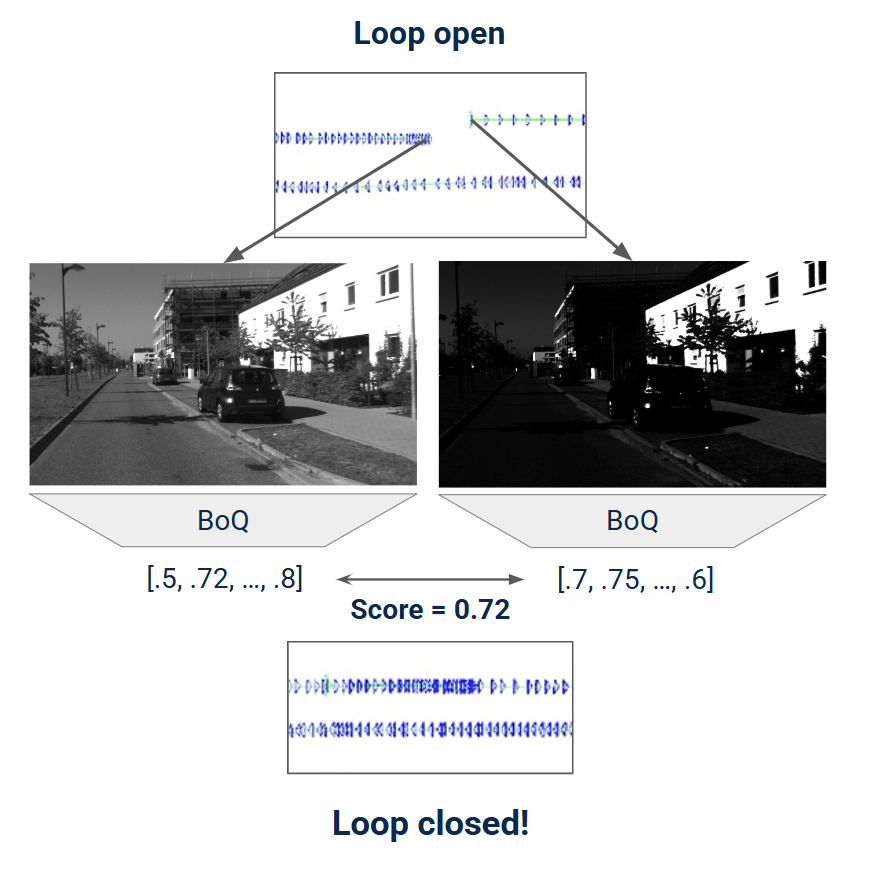
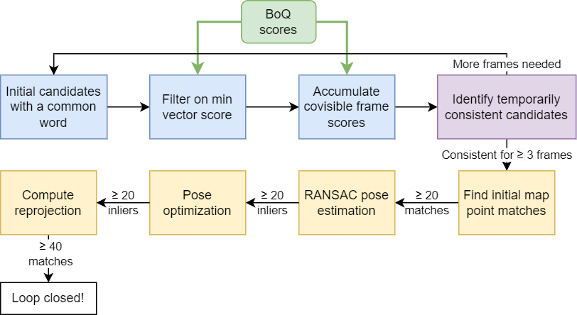

# Mobile-Robotics-W25-Group-12-Project

Project title: **Modern visual place recognition for ORB-SLAM2 loop closure in adverse scenarios**

This repository contains a modified implementation of ORB-SLAM2 that integrates modern visual place recognition (VPR) into the loop closure pipeline. It also contains tools for extracting the features from VPR models, tuning loop closure parameters, logging information from the loop closure pipeline, conducting long running ORB-SLAM experiments, and analyzing the results.

We paticularly investigate loop closure in adverse scenarios, such as lighting changes. In these scenarios, ORB-SLAM2's default bag-of-words (BoW) based VPR method may miss loop closure candidates. Modern VPR methods can potentially identify candidates that BoW would not, as depicted below. Modern VPR can also filter out more bad candidates than BoW, which could allow for relaxing of the later stages of the loop closure pipeline.



Vector scores from modern VPR models are integrated into the filter and score accumulation stages of the ORB-SLAM2 loop closure, as depicted below.



## Repository structure

This repository is split into three submodules:

- [VPR_Tutorial](https://github.com/Mobile-Robotics-W25-Group-12/VPR_FeatureExtraction/) - Repository for running feature extraction on datasets with modern VPR models, namely the [Bag of Queries](https://github.com/amaralibey/Bag-of-Queries). Forked from [stschubert/VPR_Tutorial](https://github.com/stschubert/VPR_Tutorial); we created our own Jupyter Notebook on top of this repository to streamline feature extraction.
- [ORB_SLAM2](https://github.com/Mobile-Robotics-W25-Group-12/ORB_SLAM2) - A modified ORB_SLAM2 repository to integrate feature vectors from modern VPR models into the loop closure pipeline. Also contains tools to tune loop closure parameters, perform experiments, and augment datasets. Forked from [raulmur/ORB_SLAM2](https://github.com/raulmur/ORB_SLAM2)
- [analysis](https://github.com/Mobile-Robotics-W25-Group-12/analysis) - Tools for analyzing the results of experiments ran in the `ORB_SLAM2` submodule.

# Feature extraction

Visit the [VPR_Tutorial](https://github.com/Mobile-Robotics-W25-Group-12/VPR_FeatureExtraction/) for our instructions on how compute the feature vectors for a dataset, as well as how to analyze and compare models. In our experiments, we ran `feature_extraction.ipynb` to compute the feature vectors offline with the `BoQ-DinoV2` model, saved into a single `.npy` file. This `.npy` file can then be loaded when running ORB-SLAM2.

# ORB-SLAM2

The ORB-SLAM2 portion can be found in the [ORB_SLAM2](https://github.com/Mobile-Robotics-W25-Group-12/ORB_SLAM2) submodule. We forked the ORB-SLAM2 repository and made modifications on it.

## Setup

Open the `README.md` in the `ORB-SLAM2` submodule (this is the same as the original repository). Then,

- Follow section `2. Prerequisites` in the README to install the ORB-SLAM2 prerequisites. Note that we use C++ 14 in our `CMakeLists.txt` instead of C++ 11 to fix compilation issues.
- Build the repository with `chmod +x build.sh; ./build.sh`
- Follow section `4. Monocular Examples / KITTI Dataset` to download the KITTI greyscale dataset from `http://www.cvlibs.net/datasets/kitti/eval_odometry.php`. Place the sequences in a folder called `datasets/kitti_grey/sequences`, so for example sequence `06` would be at `datasets/kitti_grey/sequences/06`.

## Usage

### Running normal ORB-SLAM2 example

The ORB-SLAM2 examples can be ran in the usual way. For instance, if KITTI sequence `06` is in `datasets/kitti_grey/sequences/06` as above, run

```bash
./Examples/Monocular/mono_kitti Vocabulary/ORBvoc.txt Examples/Monocular/KITTI04-12.yaml datasets/kitti_grey/sequences/06
```

### Data augmentation

`brightness_augment.py` allows for augmenting the brightness of some of the frames in an existing image sequence. It applies gamma correction to all frames after a certain point, and then outputs to a new sequence. Below is the documentation for the command:

```
usage: brightness_augment.py [-h] [-g GAMMA]
                             kitti_sequences_dir input_sequence_name output_sequence_name dark_frame

Augment brightness of a KITTI sequence.
Example: python3 brightness_augment.py datasets/kitti/sequences 06 06_brightness 700 -g 2

positional arguments:
  kitti_sequences_dir   Path to KITTI sequences directory.
  input_sequence_name   Name of the input sequence in the sequences directory
  output_sequence_name  Name of the output sequence (to be placed in the sequences directory)
  dark_frame            Frame ID from which to start darkening

optional arguments:
  -h, --help            show this help message and exit
  -g GAMMA, --gamma GAMMA
                        Parameter for gamma correction. Gamma > 1 darkens
```

### Loop closure parameters

The `loop_closure_params.yaml` file allows for configuring the loop closure parameters, including using the vector output from our **Feature Extraction** repository (such as from the Bag of Queries model). The parameters are as follows:

- `useVectorScores (bool)` - If `true`, use vector scores from `vectorFilepath`. If `false`, use the default ORB bag-of-words place recognition.
- `vectorFilepath (str)` - Path to a `.npy` containing feature vectors for each frame, such as generated from the **Feature Extraction** repository. It should contain one numpy array with `shape=(n, d)` and `dtype=np.float32`, where `n` is the number of frames.
- `minVectorScore (float)` - minimum vector score for the filtering stage. When `useVectorScore` is true, should be a value between `0.0` and `1.0`. When `useVectorScores` is false, this should usually be `0.0` (the filter stage will still use the smallest connected keyframe score as the minimum).
- `covisibilityConsistencyTh (int)` - number of previously consistent candidate keyframes required in the consistency check stage
- `numInitialMatchPoints (int)` - number of initial map point matches required
- `numRansacInliers (int)` - number of inliers required in the RANSAC sim(3) estimation stage
- `numOptimizationInliers (int)` - number of inliers required when optimizing the sim(3) from RANSAC
- `numProjectedMatchPoints (int)` - number of map point matches required after reprojecting the candidate using the solved sim(3) (the final stage)
- `projTreshold (int)` - threshold when searching for map point matches with `ORBmatcher::SearchByProjection` in the final stage

### Logs

After running ORB-SLAM2, a log folder will be generated in `logs/<timestamp>`. The `log.csv` provides a summary of the different loop closure stages for each keyframe. `connected_frames.csv` lists the covisible keyframes of each keyframe `k` in the graph, at the time that `k` was processed in the loop closure queue. The other `.csv` files list the candidate frame IDs of each keyframe at a certain stage, along with the similarity scores of each frame. The final frame trajectory is also saved in `CameraTrajectoryKITTI.txt`.

### Experiment runner

The experiment runner allows for running multiple trials of ORB-SLAM2 on a dataset with varying loop closure parameters. It collects the logs of the loop closure information into an experiment results folder.

The script `experiment_runner.py` takes a single parameter, which is the path to the experiment configuration JSON. The following is the schema for the experiment runner.

- `name`, `string` - name of the experiment
- `num_trial` - number of trials to run per test case
- `config`, `object`
    - `exe`, `string` - path to the ORB-SLAM2 mono executable, that should take in 3 command line arguments: `vocab`, `calib`, and `dataset`
    - `vocab`, `string` - path to the ORB vocabularly, typically `"Vocabulary/ORBvoc.txt"`
    - `calib`, `string` - path to calibration `.yaml` file for the camera
    - `dataset`, `string` - path to the dataset sequence
- `test_cases`, `array` of `object`
    - `name` - name of the test case
    - `params`, `object` - parameters for the `loop_closure_params.yaml`. Any parameters that are not specified will be set to their ORB-SLAM2 defaults.

For example, to run experiments on the KITTI 06 augmented brightness datasets with both BoW and BoQ, one may write:

```json
{
    "name": "06_brightness",
    "num_trials": 10,
    "config": {
        "exe": "./Examples/Monocular/mono_kitti",
        "vocab": "Vocabulary/ORBvoc.txt",
        "calib": "Examples/Monocular/KITTI04-12.yaml",
        "dataset": "datasets/kitti_grey/sequences/06_brightness"
    },
    "test_cases": [
        {
            "name": "bow",
            "params": {
                "useVectorScores": false,
                "minVectorScore": 0.0
            }
        },
        {
            "name": "boq",
            "params": {
                "useVectorScores": true,
                "minVectorScore": 0.6,
                "vectorFilepath": "06_brightness.npy"
            }
        }
    ]
}
```

## Implementation

We wrote/modified the following files in `ORB-SLAM`

- `MetricLogger.cc/h` - Utility for logging details about each loop closure stage for each keyframe.
- `LoopClosureConfig.h` - Loads the loop closure parameters from `loop_closure_params.yaml`.
- `VectorDatabase.h` - Database for storing feature vectors loaded from a numpy file and computing cosine similarity score between keyframes.
- `KeyFrameDatabase.cc/h` - We refactored the `DetectLoopCandidates` function into multiple functions representing each stage. We incorporated vector cosine similarity scores in place of BoW scores in the filter and accumulation stages. We also added calls to `MetricLogger` logging the candidates.
- `LoopClosing.cc` - We added calls to `MetricLogger` logging the candidates.

# Analysis

View the README in the [Analysis](https://github.com/Mobile-Robotics-W25-Group-12/Analysis/) for information on how to interpret and analyze the experiment results. 
